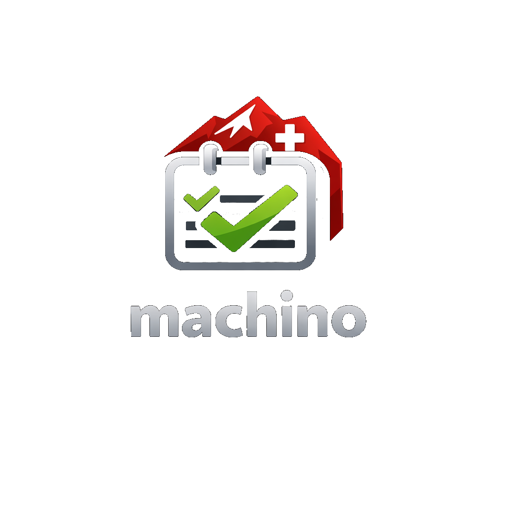

<p align="center">
  
</p>

# Machino — Mach I No

> *Schweizerdeutsch für «mach ich noch»*

Eine schlanke, kollaborative ToDo-App mit Echtzeit-Sync, Offline-Support und modernem Aurora-Dark-Design.

**Stack:** Go · gorilla/mux · gorilla/websocket · SQLite · Svelte 4 · Vite · PWA

---

## Funktionen

- **Projekte** mit Titel, Beschreibung und Farbe — als Favorit markierbar
- **Todos** mit Titel, Beschreibung, Fälligkeitsdatum, Priorität und manueller Sortierung per Drag & Drop
- **Echtzeit-Kollaboration** — mehrere Benutzer können gleichzeitig im selben Projekt arbeiten (WebSocket)
- **Offline-Support** — Änderungen werden lokal gecacht (IndexedDB) und beim Reconnect synchronisiert
- **Authentifizierung** — Registrierung, Login, Logout, Profil, Passwort-Reset per E-Mail
- **Setup-Wizard** — geführte Ersteinrichtung über die Webapp: Admin anlegen + globale Einstellungen setzen
- **Adminbereich** — Benutzer verwalten, löschen und Passwörter zurücksetzen; globale Einstellungen (SMTP, Registrierung, Domain) ohne Neustart ändern
- **Sicherheit** — Rate-Limiting auf Auth-Endpunkten, Security-Header (CSP, HSTS), CSRF-Schutz
- **Mobile-freundlich** — responsives Design mit Slide-in-Sidebar

---

## Lokale Entwicklung

### Voraussetzungen

- Go 1.25+
- Node.js 20+

### Setup

```bash
# Abhängigkeiten installieren
make install

# Backend starten (Port 8080)
make run

# Frontend starten (eigenes Terminal, Port 5173)
cd web && npm run dev
```

Der Vite-Dev-Server proxied `/api` automatisch auf das Backend.
Öffne [http://localhost:5173](http://localhost:5173).

### Nützliche Befehle

```bash
make build        # Go-Binary bauen → bin/machino-api
make web-build    # Svelte bauen → web/dist
make test         # Tests ausführen
make fmt          # Go-Code formatieren
```

### Admin-Benutzer setzen

#### Ersteinrichtung via Setup-Wizard (empfohlen)

Beim allerersten Start — solange noch kein Admin-User in der Datenbank existiert — zeigt die Webapp automatisch einen geführten Setup-Wizard an, bevor der normale Login erscheint.

**Schritt 1 — Admin anlegen:**

| Feld | Beschreibung |
|---|---|
| Name | Anzeigename des ersten Admins |
| E-Mail | Login-E-Mail |
| Passwort | Mindestens 8 Zeichen |

**Schritt 2 — Globale Einstellungen:**

| Feld | Beschreibung |
|---|---|
| App Domain | Öffentliche Domain der Instanz (z. B. `machino.example.com`) |
| Registrierung erlauben | Neue Benutzer können sich selbst registrieren |
| SMTP Host / Port | Mailserver für Passwort-Reset-E-Mails |
| SMTP Benutzer / Passwort | Anmeldedaten für den Mailserver |
| SMTP Absender | Absender-Adresse (z. B. `noreply@example.com`) |

Nach dem Abschluss ist der erstellte Benutzer direkt eingeloggt und hat Admin-Rechte.

> **Hinweis:** Umgebungsvariablen wie `SMTP_HOST`, `SMTP_PASSWORD` usw. werden **einmalig** beim ersten Start als Vorbelegung übernommen. Danach sind die Werte in der Datenbank maßgeblich und können im Adminbereich geändert werden.

#### Globale Einstellungen nachträglich ändern

Admins können alle globalen Einstellungen jederzeit ohne Neustart im Adminbereich unter **Einstellungen** ändern:

- App Domain
- Registrierung aktivieren/deaktivieren
- SMTP Host, Port, Benutzer, Passwort und Absender

Das SMTP-Passwort wird nie zurückgegeben. Ein leeres Passwortfeld beim Speichern behält das bestehende Passwort unverändert.

#### Recovery / bestehende Installationen

Für bestehende Installationen oder falls der Setup-Wizard übersprungen wurde, kann ein Admin über die Go-Anwendung gesetzt werden. Der Benutzer muss vorher bereits registriert sein:

```bash
# Lokal über Go
go run ./cmd/api --set-admin admin@example.com

# Oder mit gebautem Binary
./bin/machino-api --set-admin admin@example.com
```

Der Befehl setzt nur die Rolle auf `admin` und beendet sich danach. Beim nächsten Login sieht der Benutzer den Menüpunkt **Admin**.

---

## Konfiguration (Umgebungsvariablen)

Kopiere `.env.example` nach `.env` und passe die Werte an:

```bash
cp .env.example .env
```

| Variable | Standard | Beschreibung |
|---|---|---|
| `HTTP_ADDR` | `:8080` | Bind-Adresse des Servers |
| `DATABASE_PATH` | `machino.db` | Pfad zur SQLite-Datenbank |
| `STATIC_DIR` | `web/dist` | Pfad zum kompilierten Frontend |
| `REGISTRATION_ENABLED` | `true` | Initialwert für neue Instanzen — danach im Adminbereich steuerbar |
| `COOKIE_SECURE` | `false` | `true` wenn hinter HTTPS-Proxy (Traefik) |
| `APP_DOMAIN` | `machino.localhost` | Initialwert für Setup-Wizard und Traefik-Labels |
| `LOG_LEVEL` | `info` | `debug` · `info` · `warn` · `error` |
| `LOG_FORMAT` | `text` | `text` (Entwicklung) · `json` (Produktion) |
| `SMTP_HOST` | — | Initialwert für SMTP-Host (danach im Adminbereich) |
| `SMTP_PORT` | `587` | Initialwert für SMTP-Port (`587` STARTTLS, `465` implizites TLS) |
| `SMTP_USERNAME` | — | Initialwert für SMTP-Benutzername |
| `SMTP_PASSWORD` | — | Initialwert für SMTP-Passwort |
| `SMTP_FROM` | — | Initialwert für Absender-Adresse |

> Ohne SMTP-Konfiguration läuft der Passwort-Reset im **Demo-Modus**: der Reset-Token wird direkt in der API-Antwort zurückgegeben.

---

## Deployment mit Docker & Traefik

### Voraussetzungen auf dem Server

```bash
# Traefik-Netzwerk erstellen (einmalig)
docker network create traefik-public
```

Traefik muss mit `--certificatesresolvers.letsencrypt.acme.email=...` und den Entrypoints `web` (80) und `websecure` (443) konfiguriert sein.

### Deployment

```bash
# .env anlegen
cp .env.example .env
# APP_DOMAIN, SMTP_* etc. anpassen

# Image bauen und starten
docker compose up -d --build

# Logs beobachten
docker compose logs -f
```

Die App ist dann unter `https://$APP_DOMAIN` erreichbar. Let's-Encrypt-Zertifikat wird automatisch ausgestellt.

### Nach dem ersten Start

```bash
# Falls kein Admin über den Web-Setup-Wizard erstellt wurde:
# Einen bestehenden Benutzer zum Admin machen
docker compose exec app /app/machino --set-admin admin@example.com

# Registrierung und SMTP können danach im Adminbereich unter "Einstellungen" geändert werden.
```

Beim Start prüft das Backend die gespeicherte Datenbank-Schema-Version und führt fehlende Migrationen automatisch aus. Fehlen globale Einstellungen, werden sie einmalig aus den Umgebungsvariablen initialisiert.

### Datenbank-Backup

```bash
# Volume-Pfad ermitteln
docker volume inspect machino_machino_data

# SQLite-Datei kopieren (laufender Betrieb möglich — WAL-Modus)
cp /var/lib/docker/volumes/machino_machino_data/_data/machino.db ./backup-$(date +%Y%m%d).db
```

---

## Logging

Im **JSON-Format** (Produktion) lassen sich Logs einfach in Aggregatoren wie Loki, ELK oder CloudWatch weiterleiten:

```json
{"time":"2026-01-15T10:23:46Z","level":"INFO","msg":"http request","method":"POST","path":"/api/auth/login","status":200,"duration_ms":42,"ip":"192.168.1.1"}
{"time":"2026-01-15T10:23:46Z","level":"INFO","msg":"login success","email":"user@example.com","user_id":"abc123","ip":"192.168.1.1"}
{"time":"2026-01-15T10:23:50Z","level":"WARN","msg":"login failed","email":"unknown@x.com","ip":"10.0.0.5"}
```

Gelogte Auth-Events: `login success`, `login failed`, `user registered`, `logout`, `password reset requested`, `websocket connected/disconnected`.

---

## Mobile (Android & iOS)

Die App ist bereits als **PWA installierbar** — im Browser auf «Zum Homescreen hinzufügen».

Für native App-Store-Pakete:

1. Frontend bauen: `cd web && npm run build`
2. [Capacitor](https://capacitorjs.com/) einrichten: `npx cap init` → `web/dist` als Web-Asset
3. Native Projekte generieren: `npx cap add android` / `npx cap add ios`
4. Das Go-Backend bleibt als API unverändert bestehen

---

## Projektstruktur

```
machino/
├── cmd/api/          # Einstiegspunkt (main.go)
├── internal/
│   ├── handler/      # HTTP-Handler, Middleware (Auth, Rate-Limit, Logging)
│   ├── model/        # Datenmodelle
│   ├── realtime/     # WebSocket-Hub
│   ├── store/        # SQLite-Datenbankschicht
│   └── mailer/       # SMTP-Mailer
├── web/              # Svelte 4 Frontend
│   └── src/
│       └── components/
├── Dockerfile        # Multi-Stage Build
├── docker-compose.yml
└── .env.example
```
